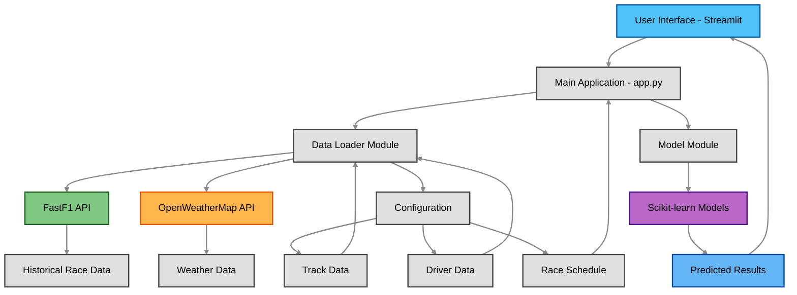

# 🏎️ Formula-1 Race Predictor

A machine learning-powered application that predicts Formula 1 race results using historical data, driver performance metrics, and weather conditions.

## Table of Contents
- [Features](#-features)
- [Architecture](#-architecture)
- [Installation](#-installation)
- [Usage](#-usage)
- [Data Sources](#-data-sources)
- [Project Structure](#-project-structure)
- [Contributing](#-contributing)
- [License](#-license)

## Features

- **Multi-Race Support**: Predict results for any race on the F1 calendar
- **Real-time Weather Integration**: Incorporates weather forecasts using OpenWeatherMap API
- **Driver Performance Analytics**: Uses historical lap times, qualifying performance, and team data
- **Visual Predictions**: Interactive charts showing predicted results and time gaps
- **Machine Learning Model**: Gradient boosting algorithm for accurate predictions
- **Track-Specific Analysis**: Different parameters based on circuit characteristics

## Architecture



## Installation

### Prerequisites
- Python 3.8+
- Git

### Setup
1. Clone the repository:
```bash
git clone https://github.com/BLShaw/f1-predictor.git
cd f1-predictor
```

2. Create a virtual environment (recommended):
```bash
python -m venv venv
source venv/bin/activate  # On Windows: venv\Scripts\activate
```

3. Install required packages:
```bash
pip install -r requirements.txt
```

4. Set up your OpenWeatherMap API key in `src/config.py` or in UI:
```python
WEATHER_API_KEY = "your_api_key_here"
```

## Usage

Run the Streamlit application:
```bash
streamlit run app.py
```

The application will open in your default browser where you can:

1. **Select a Race**: Choose from any race on the 2025 F1 calendar
2. **Configure Parameters**: Adjust model settings in the sidebar
3. **Run Prediction**: Generate race predictions with one click
4. **Analyze Results**: View predictions, performance metrics, and visualizations

### Key Features in UI:
- **Race Selection Panel**: Choose any race from the schedule
- **Configuration Panel**: Adjust model parameters
- **Data Loading Section**: Shows real-time loading status
- **Prediction Dashboard**: View predicted results and insights
- **Visualization Gallery**: Charts for performance analysis

## Data Sources

### Primary Data Sources
- **F1 Timing Data**: FastF1 library for historical lap times and sector data
- **Weather Data**: OpenWeatherMap API for weather conditions
- **Driver/Team Data**: F1 records and statistics

### Model Parameters
- **Qualifying Performance**: Driver's qualifying time for the selected race
- **Historical Data**: Average lap times and sector performance from previous seasons
- **Team Performance**: Current season team points and performance metrics
- **Weather Conditions**: Rain probability and temperature forecasts
- **Track Characteristics**: Position changes specific to the selected track

## Project Structure

```
f1-race-predictor/
├── README.md          # Project documentation
├── app.py             # Main Streamlit application entry point
├── requirements.txt   # Python dependencies
├── f1_cache/          # FastF1 data cache
└── src/               # Source code modules
    ├── __init__.py    # Python package initialization
    ├── config.py      # Configuration and constants
    ├── data_loader.py # Data loading and preprocessing
    └── model.py       # ML model implementation
```

### Module Descriptions:

#### `app.py`
- Streamlit-based UI
- Race selection interface
- Visualization dashboard
- Model execution orchestration

#### `src/config.py`
- API keys and credentials
- Track coordinates and weather data
- Driver and team mappings
- Race schedule information
- Model parameters and constants

#### `src/data_loader.py`
- F1 session data loading using FastF1
- Weather data fetching from OpenWeatherMap
- Data processing and aggregation
- Track-specific data adjustments

#### `src/model.py`
- Gradient Boosting Regressor implementation
- Feature engineering
- Model training and prediction
- Performance metrics calculation

## Prediction Methodology

The predictor uses several key factors:

1. **Driver Performance**: Historical lap times and sector performance
2. **Qualifying Data**: Expected qualifying performance for the race
3. **Team Metrics**: Team performance based on current season points
4. **Weather Impact**: Rain probability and temperature effects
5. **Track Characteristics**: Circuit-specific position change patterns

## Contributing

We welcome contributions! Here's how you can help:

1. **Fork the Repository**: Create your own copy to experiment
2. **Create Feature Branch**: `git checkout -b feature/amazing-feature`
3. **Commit Changes**: `git commit -m 'Add some amazing feature'`
4. **Push to Branch**: `git push origin feature/amazing-feature`
5. **Open Pull Request**: Submit for review

## Disclaimer

This application is for educational and entertainment purposes only. Predictions are based on historical data and statistical models, and do not represent actual race outcomes.

## License

This project is licensed under the MIT License - see the [LICENSE](LICENSE) file for details.

## Support

If you encounter issues or have questions, please:

1. Check the [Issues](https://github.com/username/f1-predictor/issues) section
2. Open a new issue if needed
3. Provide detailed information about the problem

## Acknowledgments

- **FastF1** library for F1 data access
- **OpenWeatherMap** for weather data
- **Formula 1** for making this sport amazing
- **Streamlit** for the web interface framework