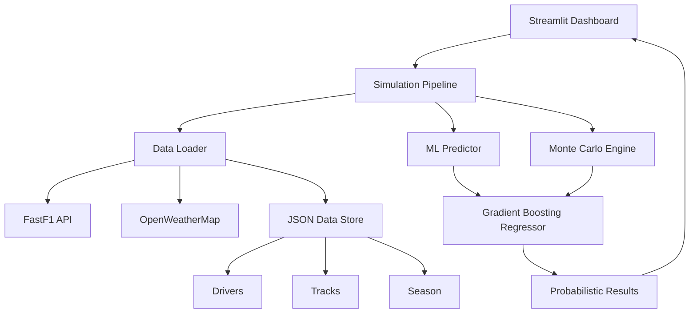

# 🏎️ F1 Strategy AI Pro

A professional-grade machine learning application for Formula 1 race strategy and prediction. It combines historical data, Monte Carlo simulations, and granular strategy controls to forecast race outcomes.

## Table of Contents
- [Features](#-features)
- [Architecture](#-architecture)
- [Installation](#-installation)
- [Usage](#-usage)
- [Data Sources](#-data-sources)
- [Project Structure](#-project-structure)
- [Contributing](#-contributing)
- [License](#-license)

## Features

- **🛡️ Race Control Center**: Full control over race conditions, weather, and driver performance overrides.
- **♟️ Tyre Strategy Engine**: Simulate the impact of starting compounds (Soft/Medium/Hard) on race pace.
- **🔮 Monte Carlo Simulation**: Run 1,000+ parallel race simulations to determine win probabilities and confidence intervals.
- **📊 Telemetry Dashboard**: Interactive analytics showing feature importance and pace-vs-position correlations.
- **🌤️ Real-time Weather**: Dynamic integration with OpenWeatherMap for race-day conditions.
- **📈 Interactive Visualizations**: Powered by Plotly for granular data exploration.

## Architecture



## Installation

### Prerequisites
- Python 3.8+
- Git

### Setup
1. Clone the repository:
```bash
git clone https://github.com/BLShaw/f1-predictor.git
cd f1-predictor
```

2. Create a virtual environment (recommended):
```bash
python -m venv venv
source venv/bin/activate  # On Windows: venv\Scripts\activate
```

3. Install required packages:
```bash
pip install -r requirements.txt
```

4. Set up your OpenWeatherMap API key in `src/config.py` (or enter it in the UI):
```python
WEATHER_API_KEY = "your_api_key_here"
```

## Usage

Run the Streamlit application:
```bash
streamlit run app.py
```

The application is organized into three main tabs:

### 1. 🏁 Race Control
- **Setup**: Select circuit and configure weather (Rain/Temp).
- **Strategy**: Adjust driver pace and select starting tyre compounds.
- **Initialize**: Load data and run the baseline model.

### 2. 📊 Telemetry Dashboard
- **Analysis**: View baseline predictions and model confidence.
- **Insights**: Explore feature importance and pace correlations.

### 3. 🔮 Monte Carlo Analysis
- **Simulation**: Run 1,000 iterations of the race with randomized noise.
- **Probabilities**: View Win % and Podium % for every driver.
- **Confidence Intervals**: Analyze the "Best Case" (P5) and "Worst Case" (P95) scenarios.

## Data Sources

### Primary Data Sources
- **F1 Timing Data**: FastF1 library for historical lap times and sector data
- **Weather Data**: OpenWeatherMap API for weather conditions
- **JSON Configuration**: curated datasets for 2025 season assumptions

## Project Structure

```
f1-race-predictor/
├── README.md          # Project documentation
├── app.py             # Main Streamlit application
├── requirements.txt   # Python dependencies
├── .gitignore
├── f1_cache/          # FastF1 data cache
├── data/              # JSON Data Store
│   ├── drivers.json
│   ├── season.json
│   ├── teams.json
│   ├── tracks.json
│   └── tyres.json
├── src/               # Source code modules
│   ├── __init__.py
│   ├── config.py      # Configuration loader
│   ├── data_loader.py # ETL logic
│   └── model.py       # ML & Monte Carlo engine
└── tests/             # Unit tests
```

## Prediction Methodology

The predictor uses a **Gradient Boosting Regressor** trained on historical data, augmented by a **Monte Carlo** engine:

1.  **Baseline**: Predicts finishing position based on qualifying, pace, and track characteristics.
2.  **Simulation**: Perturbs key variables (Race Pace, Pit Loss) with Gaussian noise.
3.  **Aggregation**: Aggregates 1,000 outcomes to determine probabilistic rankings.

## Contributing

We welcome contributions! Please open an issue or PR on GitHub.

## Security

This project is regularly scanned with **Bandit** for Python security vulnerabilities. API keys are handled securely via environment variables or masked inputs.

## License

This project is licensed under the MIT License - see the [LICENSE](LICENSE) file for details.