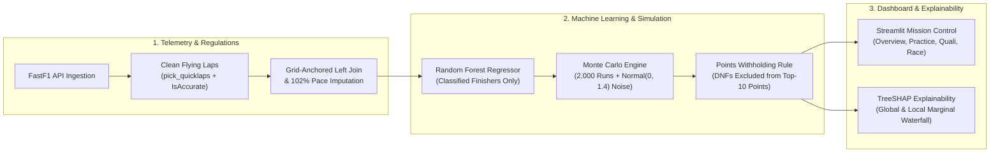

# F1 Predictor

A Formula 1 prediction engine combining Monte Carlo simulation with Machine Learning for Grand Prix outcomes.

[](https://github.com/BLShaw/f1-predictor/actions/workflows/ci.yml)
[](https://www.python.org/)
[](https://github.com/astral-sh/ruff)
[](tests/)
[](LICENSE)

---

## Architecture


```mermaid
flowchart LR
    subgraph Data["1. Telemetry & Regulations"]
        A["FastF1 API Ingestion"] --> B["Clean Flying Laps\n(pick_quicklaps + IsAccurate)"]
        B --> C["Grid-Anchored Left Join\n& 102% Pace Imputation"]
    end

    subgraph Model["2. Machine Learning & Simulation"]
        C --> D["Random Forest Regressor\n(Classified Finishers Only)"]
        D --> E["Monte Carlo Engine\n(2,000 Runs + Normal(0, 1.4) Noise)"]
        E --> F["Points Withholding Rule\n(DNFs Excluded from Top-10 Points)"]
    end

    subgraph Serving["3. Dashboard & Explainability"]
        F --> G["Streamlit Mission Control\n(Overview, Practice, Quali, Race)"]
        F --> H["TreeSHAP Explainability\n(Global & Local Marginal Waterfall)"]
    end
```

---

## Key Features

- **Grand Prix Centric**: Organizes session data by Season and Round across Free Practice, Qualifying, Sprint Shootout, Sprint Race, and Grand Prix.
- **ML / Monte Carlo Engine**: Trained Random Forest Regressor combined with a 2,000-iteration stochastic simulation incorporating physics-calibrated lap variance ($\mathcal{N}(0, 1.4)$).
- **Non-Finisher Points Withholding**: Simulated DNFs are strictly excluded from top-10 points allocation, advancing classified finishers into vacated championship points positions.
- **SHAP Explainability**: Global feature importances and per-driver marginal waterfall breakdowns explaining *why* each driver is predicted to finish in a given position.
- **Regulatory Rules Support**: Full support for Sprint Weekends, dynamically handling 2022 sprint rules (Saturday sprint sets Sunday grid) versus 2023+ regulations (qualifying sets Sunday grid; shootout sets sprint grid), and 20 vs. 22 car knockout thresholds.
- **Decoupled Architecture**: Framework-agnostic domain and modeling logic separated from Streamlit presentation and state caching adapters.

---

## Model Performance

The core ML engine (`RandomForestRegressor`) is trained on historical telemetry pace and qualifying results from 2022 to the present across temporal out-of-time splits (Train: 2022–2024, Validation: 2025, Test: 2026):

| Benchmark Metric | Out-of-Time Test (2026) | Baseline (Grid Only) | Model Delta |
| :--- | :--- | :--- | :--- |
| **Points Finish Accuracy (Top 10)** | **76.7%** (F1: 0.798) | 68.4% (F1: 0.680) | **+8.3% accuracy** |
| **Podium Finish Accuracy (Top 3)** | **87.2%** (F1: 0.583) | 82.8% (Dummy Prior) | **+4.4% accuracy** |
| **Mean Absolute Error (MAE)** | **2.43 positions** | 3.20 positions | **-0.77 pos error** |
| **Root Mean Squared Error (RMSE)** | **3.05 positions** | 4.12 positions | **-1.07 pos error** |
| **Explained Variance ($R^2$)** | **0.656** | 0.474 | **+38.4% explained variance** |

*Target labels during training are strictly restricted to classified race finishers to prevent mechanical retirement label corruption.*

---

## Installation & Setup

### 1. Clone the Repository
```bash
git clone https://github.com/BLShaw/f1-predictor.git
cd f1-predictor
```

### 2. Install Dependencies
```bash
pip install -r requirements.txt
```

### 3. Run Quality Verification & Tests
```bash
ruff check .
pytest -v
```

### 4. Run Application
```bash
streamlit run app.py
```

---

## CLI Pipelines

```bash
# Ingest historical session telemetry (2022 to present)
python scripts/download_historical_data.py

# Retrain model and evaluate temporal out-of-time splits
python scripts/train_historical_model.py
```

---

## Screenshots


---

## License

MIT License. See [LICENSE](LICENSE) for details.
